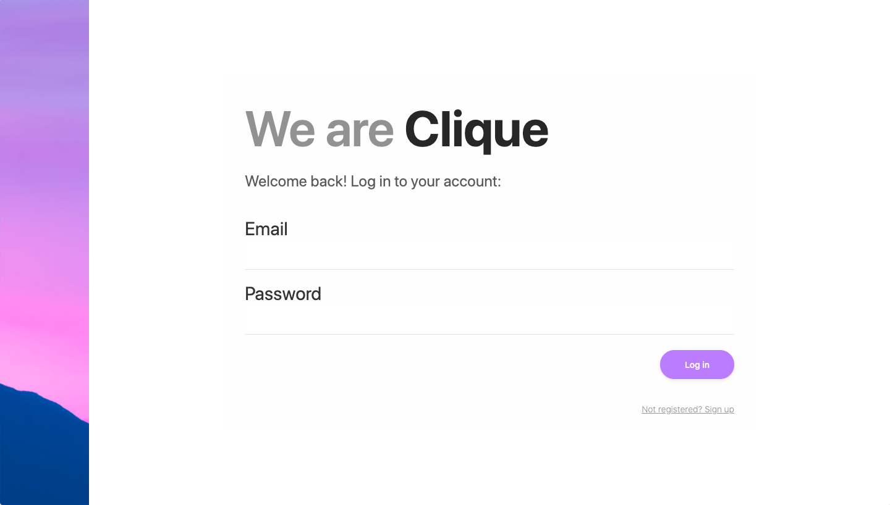

# Clique  || Overview
I and four of my team-mates had to create a full stack web app using JavaScript,  MongoDB, ExpressJS and ReactJS. This is the first time working in a group project at the General Assembly.

You can view my project live here: ----> https://clique-app.herokuapp.com/

# What is our project about?

We all decided to create an event like social media site. We aimed for Clique to be of  Instagram and Facebook Events. You can invite friends, like and comment on events, create public or private events and view people's profiles.

Technologies Used:

* JavaScript (ES6)
* Sass
* MongoDB
* Mongoose
* ExpressJS
* ReactJS
* Git and GitHub

# Planning

Here is a screenshot of our project plan. As you can see we added a profile schema, register schema and events schema to our backend. 

# Approach
We as a group decided to work on the backend together by taking in turns to code while using live share. Once the backend was complete, we discussed what tasks each of us will be doing the next few days. We as a team decided to use and build our own API for this project. 

# Mongoose Schema's
Here is a screenshot of our event schema:

# Controllers

We created three controllers for our backend. Event controller, profile controller and user controller. The controllers did take a long time to get done even some of my team members would go back to add more features. Once the backend was complete, we split up and set out tasks for each other. My task was to create three pages on the front end of the project. 

# Frontend

My task was to create the login and sign up page as well as the search page. I did all the CSS/SASS for the login and sign-up page. I relised the search page looks plain. It would be great if i had added some stylying. 

Here is my code for the login page

Here is what it looks like with CSS:

Creating the search page was a challenge for me. It did take me a while for me to figure out what was wrong. I resolved the problem with the help of a team member.

# Wins 
I did take a long time working out the search page. With the help of my team mates I managed to get it working on time. 

# Challenges + Lessons Learned
There was a lot to learn from this experience. It was my first time working in a group. At the begging, getting used to working with git with my teammates was very difficult. We ran into many conflicts, but we manage to resolve the problem fairly quickly. 

We only had one week to complete this project. As I look back, It did take me a long time to finish my tasks. I wish that I had done more since some of my team members did my work than me. In the future, my next project, I will make sure to manage my time more efficiently.
